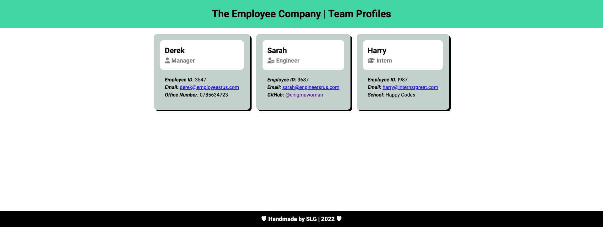

# 10 Object-Oriented Programming | Team Profile Generator

Build of a OOP application, that will auto generate a Team Profile HTML page

---

**Table of Contents:**

* [Description](#description)
* [User Story](#user-story)
* [Installation](#installation)
* [Usage](#usage)
* [Acceptance Criteria](#acceptance-criteria)
* [Installation](#installation)
* [Testing](#testing)
* [Using the code](#using-the-code)
* [The Team Profile Generator](#the-team-profile-generator)
    * [Video Demonstration](#video-demonstration)
    * [Screenshot of the Profile Generator](#screenshot-of-the-profile-generator)
* [License](#license) 
* [Questions](#questions)

---

## Description

Generating JavaScript code, that when propmted to run by the user in the terminal a series of questions will be asked, of which the answers to, will auto-generate a an HTML displaying a Team Profile.

## User Story

AS A manager
I WANT to generate a webpage that displays my team's basic info
SO THAT I have quick access to their emails and GitHub profiles

## Acceptance Criteria

* GIVEN a command-line application that accepts user input
* WHEN I am prompted for my team members and their information
* THEN an HTML file is generated that displays a nicely formatted team roster based on user input
* WHEN I click on an email address in the HTML
* THEN my default email program opens and populates the TO field of the email with the address
* WHEN I click on the GitHub username
* THEN that GitHub profile opens in a new tab
* WHEN I start the application
* THEN I am prompted to enter the team manager’s name, employee ID, email address, and office number
* WHEN I enter the team manager’s name, employee ID, email address, and office number
* THEN I am presented with a menu with the option to add an engineer or an intern or to finish building my team
* WHEN I select the engineer option
* THEN I am prompted to enter the engineer’s name, ID, email, and GitHub username, and I am taken back to the menu
* WHEN I select the intern option
* THEN I am prompted to enter the intern’s name, ID, email, and school, and I am taken back to the menu
* WHEN I decide to finish building my team
* THEN I exit the application, and the HTML is generated


The main challenge i faced, was getting used to using the testing function for the first time, and managing more than 3 code files, however, after practising and doing some online research, I am more comfortable managing and linking multiple code files and then testing the code before deployment. 

I also had the opportunity to practise and refine my current HTML, CSS and JavaScript skills.

## Installation

Start by downloading the code from the repository, then load in VS code, open a terminal and make sure you are in the project folder.
Initialise the code by typing into the terminal:
```bash
npm init -y
npm i inquirer@8.2.4
npm i jest
```

Then add *"start": "node index.js"* and add *jest* as the test command.

## Testing

In order to test the code is working before the html generation, enter into the terminal:
```bash
npm run test
```
The tests should all return as passed:


## Using the code

To get the Team profile generator code to run you will need to enter into the terminal:
```bash
node index.js
```
 and you will be prompted with a series of questions, the answers to these questions will fill in the sections of the HTML required to auto generate a Team Profile HTML page. Add the end of the code you should see a 'Team Page Created' message logged and the generated HTML file will be added to the "dist" folder for you.

I have fully commented the JavaScript files, to explain the flow and logic of the code, so that others can work on this and expand on it too.


## The Team Profile Generator

### Video demonstration.


<a href="https://drive.google.com/file/d/1rpxGvoVnJx_d3uiI7cAGyBWBkQAyeVD3/view"><b>Link to FULL VERSION video Demonstration</b></a>

Shortened version embedded below:


https://user-images.githubusercontent.com/112570078/205699422-9de47e9c-e5fb-4a9f-8b3d-bffff4329eda.mp4

### Screenshot of the Team Profile Generator




## License

NA

## Questions

If you have any questions, reach out at [@enigmawoman](https://github.com/enigmawoman)</br>
Alternatively, send your questions to readme@generator.com
